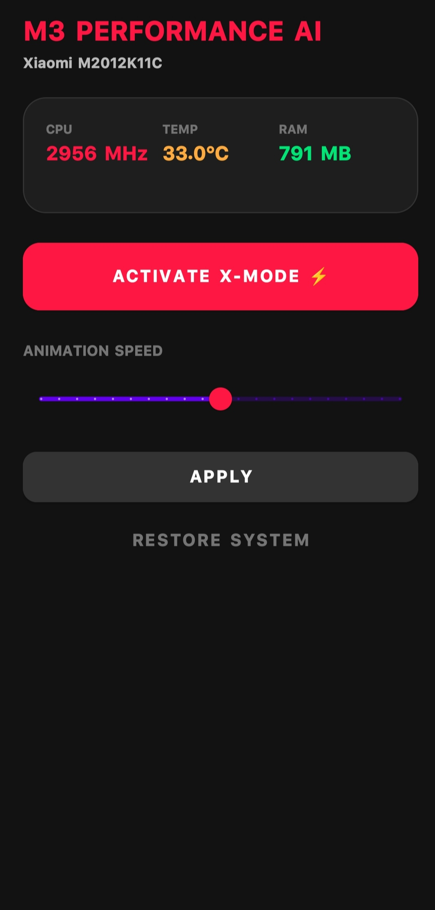

# 🚀 M3 Performance AI - Poco X3 Pro Edition

  

  
  
  

---

## 🌟 حول المشروع
**M3 Performance AI** هو مشروع متكامل يهدف إلى كسر قيود الأداء في هاتف **Poco X3 Pro**. المشروع ليس مجرد تطبيق، بل هو موديل نظام (Magisk Module) يربط بين واجهة المستخدم الأنيقة وسكربتات تحسين النواة العميقة.

---

## 🛠 المميزات التقنية
* ⚡ **X-Mode AI:** تفعيل أقصى تردد للمعالج (2956 MHz) لتحقيق سلاسة فائقة في الألعاب.
* 🧊 **إدارة الحرارة:** نظام ذكي لمنع ارتفاع الحرارة المفاجئ أثناء الضغط العالي.
* ✨ **واجهة Material Design:** تصميم داكن عصري مستوحى من لغة تصميم جوجل الجديدة.
* 🛡 **تكامل النظام:** يتم تثبيت التطبيق في `system/priv-app` لضمان عمله كجزء أصيل من الأندرويد.

---

## 📥 التحميل والتثبيت
للحصول على أفضل أداء، يوصى دائماً بتحميل الإصدار الأخير المدمج:

  

### خطوات التثبيت:
1. قم بتحميل ملف الـ `ZIP` من قسم **Releases**.
2. افتح تطبيق **Magisk** واضغط على قسم الإضافات (Modules).
3. اختر **Install from storage** وقم بتحديد الملف الذي حملته.
4. بعد اكتمال التثبيت، أعد تشغيل الهاتف (Reboot).

---

## 📱 متطلبات التشغيل
- هاتف **Poco X3 Pro** (أو أجهزة Snapdragon 860).
- وجود صلاحيات الـ **Root** (Magisk).
- نظام أندرويد 11 أو أحدث.

---

## 👨‍💻 المطور
تم تطوير هذا المشروع بشغف بواسطة **Nemsi**. 

---

  تم التحديث في 2026 - جميع الحقوق محفوظة

